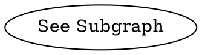

# DotTreeViz
A simple web app for rendering multiple GraphViz graphs at once.
The graph elements can also contain custom attributes, which will be listed when clicked.

Open the [Web app](https://dot-tree-viz.vercel.app/)!

The input format is `dot`, but multiple graphs can be concatinated.
Using the `_subgraph` attribute, a hirerarchy of graphs is made.


## Dependencies
To install all dependencies, use

``` bash
npm install
```

## Developing
Start a development server and open the app in your browser using:
```bash
npm run dev -- --open
```

## Building
Create a production version using:
```bash
npm run build
```

You can preview the production build with `npm run preview`.

